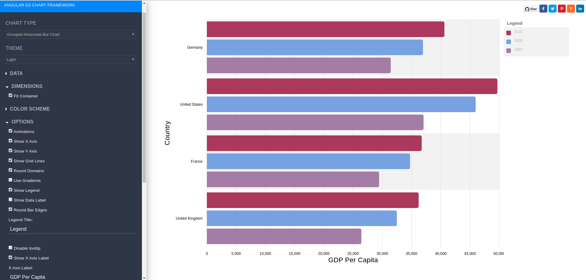

# ANGULAR NGX-CHARTS FRAMEWORK (12.0.0)

* [swimlane ngx-charts: Demo](https://swimlane.github.io/ngx-charts)
* [swimlane ngx-charts: Repo](https://github.com/swimlane/ngx-charts/tree/7.x)



---

## Development server
This project was generated with Angular CLI version 7.0.7.

Navigate inside the cloned folder then install the dependencies using:
```text
cd ngx-charts-7.x
npm install
```

Run `npm start` for a dev local server.

Navigate to `http://localhost:9999/`. The app will automatically reload if you change any of the source files.
